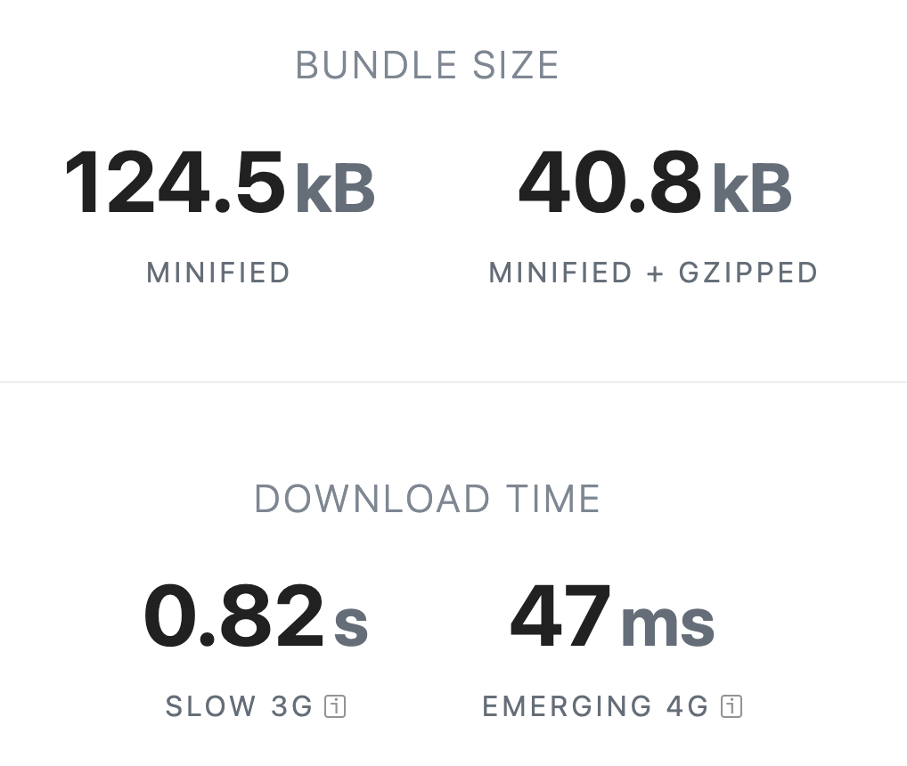
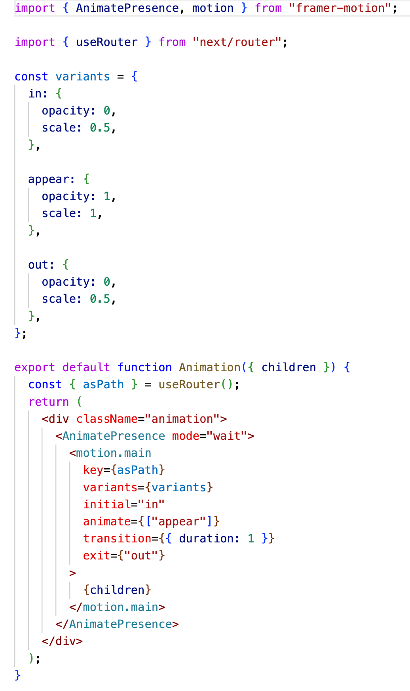
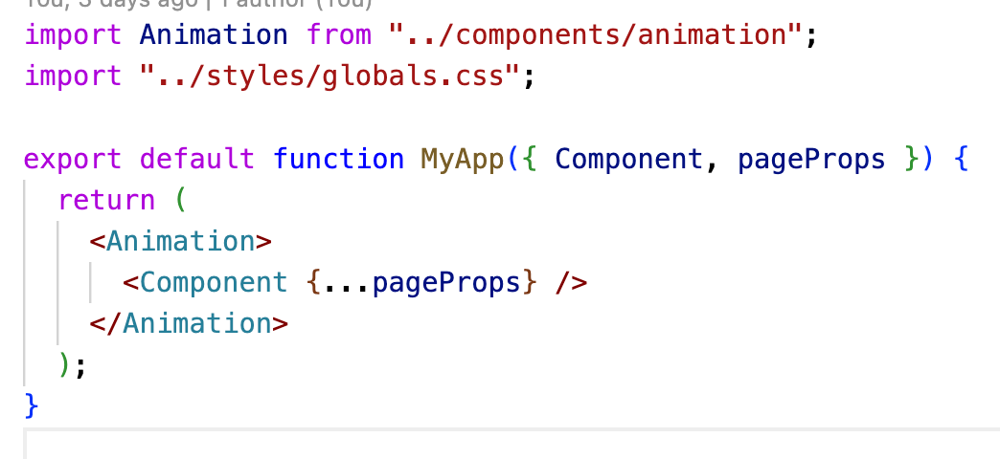

# Framer motion

#### General Information

- last updaded: last week
- github repo: https://github.com/pmndrs/react-spring

#### Bundle Size

#### Code implementation

|                      Animation Component                       |                         \_app.tsx                         |
| :------------------------------------------------------------: | :-------------------------------------------------------: |
|  |  |

#### animation example

https://user-images.githubusercontent.com/126564345/233594411-d5b22575-1448-455f-9cce-3209927d2c27.mov

# React Spring

#### General Information

- last updaded: last week
- github repo: https://github.com/pmndrs/react-spring

#### Bundle Size

#### Code implementation

|                       Animation Component                       |                            \_app.tsx                            |
| :-------------------------------------------------------------: | :-------------------------------------------------------------: |
|  |  |

#### animation example

https://user-images.githubusercontent.com/126564345/233356192-b4ed2d7e-bd07-49c1-a689-813117ee6471.mov
