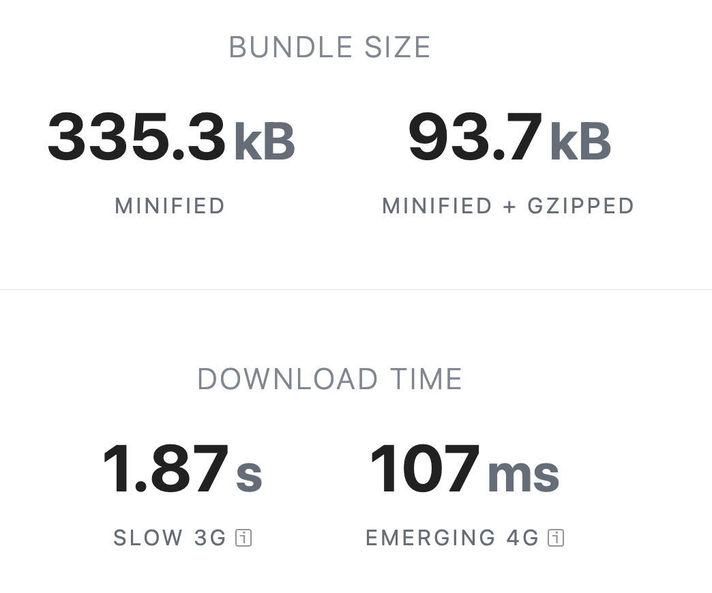

# Framer motion

#### General Information

- last updaded: last week
- github repo: https://github.com/pmndrs/react-spring

#### Bundle Size

#### Code implementation

|                      Animation Component                       |                         \_app.tsx                         |
| :------------------------------------------------------------: | :-------------------------------------------------------: |
|  |  |

#### animation example

https://user-images.githubusercontent.com/126564345/233594411-d5b22575-1448-455f-9cce-3209927d2c27.mov

# React Spring

#### General Information

- last updaded: last week
- github repo: https://github.com/pmndrs/react-spring

#### Bundle Size

#### Code implementation

|                       Animation Component                       |                            \_app.tsx                            |
| :-------------------------------------------------------------: | :-------------------------------------------------------------: |
|  |  |

#### animation example

https://user-images.githubusercontent.com/126564345/233356192-b4ed2d7e-bd07-49c1-a689-813117ee6471.mov

# Swup.js
#### General Information 
+ last updaded: 5 days ago
+ github repo: https://github.com/swup/swup

#### Bundle Size 

#### Code implementation

Animation Component            |  _app.tsx              | global.css
:-------------------------:|:-------------------------:|:-------------------------:
  |   | 

#### animation example

https://user-images.githubusercontent.com/126564345/233966531-f5a366f9-1c5f-4be2-a2f5-4a37b8287fb0.mov

# Animate.css

#### General Information 
+ last updaded: 29/6/2022
+ github repo: https://github.com/animate-css/animate.css

#### Bundle Size 

#### Code implementation

#### animation example

https://user-images.githubusercontent.com/126564345/233620402-0048b4d5-2ffa-4da6-a4c8-5a72c6e1b671.mov

# Mui

#### General Information 
+ last updaded: one day ago
+ github repo: https://github.com/mui/material-ui

#### Bundle Size 

#### Code implementation

Created Hook            |  _app.tsx              
:-------------------------:|:-------------------------:|
  |   | 

#### animation example

https://user-images.githubusercontent.com/126564345/234823298-658b68ef-e064-4a01-b935-3a5eaec85788.mov

